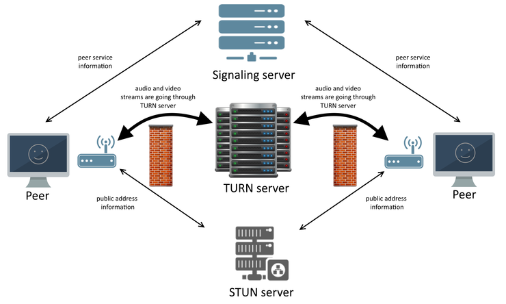

# setting up typescript

1. npm install -g typescript
2. npm i -D typescript tslint
3. tsc --init
4. uncomment the --->>>  "outDir": "./dist", // here there will be all compiled code from ts to js.
5. uncomment below one as well
 "noImplicitReturns": true,
    "noImplicitOverride": true,
    "noUnusedLocals": true,
    "noUnusedParameters": true
6. add below one as well
 "exclude": ["node_modules"],
  "include": ["./src/**/*.ts"]


# server setup
* we setup our basic backend with typescript
* Now for the first time handsake between two client we have to setup the server, after first time handsake webrtc will take cantrol so for this i will install express and socket.io.

```npm i express socket.io```

refer github : https://github.com/peers/peerjs-server
install peerjs : $ npm install peer -g
run command :  peerjs --port 9000 --key peerjs --path /myapp

# Understanding Internals of webRtc.

* Any application that you see today they are rely on the webrtc internally like zoom, google meet etc. and it's really very good in terms of audio and video call, it is based on UDP.

* In order to understand the internals of webrtc we must have to understand the NAT(Network address translator)

* What is NAT?
    - As of now we have two standards for ip addresses (i)IPV4 (ii)IPV6
    - So whenever we connect to internet either we get allocated to IPV4 OR IPV6
    - IPV6 was build because there were limited number of IP address combination we can made form IPV4.
    - The number of IPv4 address combinations is limited because they are designed as 32-bit binary numbers, which mathematically restricts the total address space to \(2^{32}\) (roughly 4.3 billion) unique combinations. When this protocol was created, this amount was considered more than enough for the experimental network, and the rapid growth of internet-connected devices was not anticipated.
    
* if the ipv4 address is limited then how even today i get the ipv4 address?
    - if i run ipconfig in my cmd then i got below one how is it possible today as well?
         Connection-specific DNS Suffix  . :
   IPv6 Address. . . . . . . . . . . : 2401:4900:a132:96b5:4cf:40c5:b607:30e4
   Temporary IPv6 Address. . . . . . : 2401:4900:a132:96b5:1d4:461a:eb8a:1eee
   Link-local IPv6 Address . . . . . : fe80::844a:306a:16d1:3e0c%11
   IPv4 Address. . . . . . . . . . . : 10.175.173.247
   Subnet Mask . . . . . . . . . . . : 255.255.255.0
   Default Gateway . . . . . . . . . : fe80::accc:6ff:fe22:867f%11
                                       10.175.173.5

* Ans : if you have 10 devices in your home and each one want to connect to the internet then it must connect with the internet and to connect with internet we need a public ip address which is limited.

    - so we can ask to my ISP that i need 10 public ip in order to connect with internet.
    - but this is not how ISP works they can't provide you 10 diff public ip because of limitation.
    
    - you said you have 10 devices then you must have a router because in today's you can't hold 10 different simcard for each devices for a sound mind people, so you must have a router.

    - So all your 10 devices are depend for internet on router and router is connected with public ip address and router give private ip address to those devices which is connected from the router.

    - inside the router there is something called NAT(Network address translator).
    - if someone else in the world want to connect with the my mobile devices then they will not connect to my mobile devices directly rather they will communicate with my router and router send those info to my mobile devices.

    - in-short we can say that for multiple devices there is only one public ip address that's are connected to the internet and rest have private ip, and using the NAT router make communication easy by mapping private to public ip address.

* What is static ip?
    - public and private ip is all about visibility
    - when we need static vs dynamic ip?

    - suppose there is a server and there are millions of people who want to connect to that server so here the bare minimum criteria is the public ip must not change frequetly, if it changes then they will loose the customer think about flipkart, amazon server.

    - in case of our router we don't need the static ip becuse no one in the world would like to connect to my router even if i am the owner i don't want that other people use my private router so here in this case dynmic ip is good, meaning everytime i connect with internet we got new ip address.

    
    #### Hurdle : webrtc is a peer to peer connection but
    * 1st hurdle --> two clients or browsers are not directly accessible on the internet because they don't have the public ip address, insted the router has the public ip address.

    * 2nd hurdle ---> machine connected to router don't know the public ip.

    * Now the question come if two machines don't know their ip address then how can they communicate on the internet?

    **Is really webrtc is peer to peer connection**

    * The answer is no, webrtc is not purely peer to peer connection.
    * And the reason is in order to communicate between two clients we must have to exchange some information.
    * and this information is called *SDP*(session description protocol) 
    * SDP contains following things:
        - it contains the description of multimedia content.
        - format of multimedia content
        - encryption

    * suppose there is two client c1 and c2 first the client c1 offer the SDP to client c2 and then when client c2 is ready to accept the audio or video by matching the type of the multimedia content, codex, encryption etc then the c2 accept the offer and answer SDP, this complete process is happening on a server called SIGNILING SERVER.

    * When the handsake is done then the client c1 send an ICE candidate and when c2 accepts the ICE candidates, a connection is establised between these two clients.

    ## what is ICE candiates?
    * ICE(Interactive Connectivity Establishment candidate) candiate is a way of communication, that if two clients are not able to communicate directly then using the STUN server then it use the TURN SERVER so, ICE candidate tells us the possible way of communication and which one is the best.

    ## Need of STUN server?
    * From the above discussion we understood that the two devices don't know public ip address they know their private ip but for communication on internet we must have the public ip address, but two independent machine in two corner of the world don't know each other ip address then how it will know each other ip address and who will tell them each other ip address.

    *Real life example*
    * Suppose there is two friend A & B, in the childhood they don't have their own phone so whenever friend A want to talk to friend B then friend A call to friend B father and their father give phone to his children and then these two freinds talk with each other, so here our machine is responsible to tell their public ip address to other device but how?

    * here comes into the picture of STUN server.
    * STUN : Session Traversal Utilities for NAT
    * STUN server allow a machine to find their public ip address.
    * So suppose you have client c1 and connected with internet by router so our client C1 will make request to the STUN server which will go through the server and the STUN server will return the public ipv4 address with port.

    * There can be 5% chances in which due to firewall or some other network configuration direct communication between two client is not possible.

    * to solve this problem we need one more intermediary layer to relay the information, and this is the place where TURN server come into the picture.

    ## TURN SERVER(Traversal Using Relays around NAT)
    

    * the main work of TURN server is to by pass the firwall and communicate with each other on internet, for better understanding see the image, visualise this like if two enemy are not able to solve their problem by themselves then they go to the third person which listen to both person and solve the problem.

    * TURN server is extension of stun server, so the TURN server can do both things.


